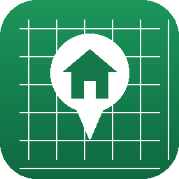
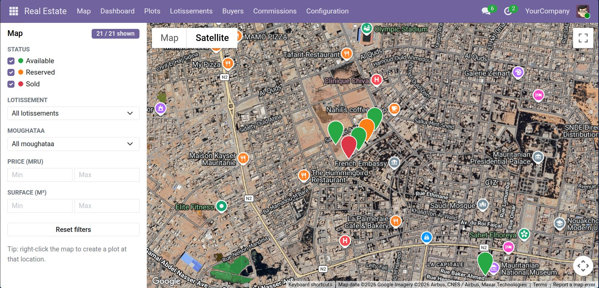
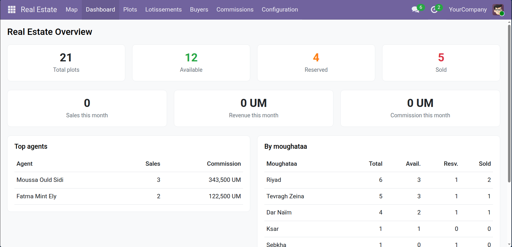
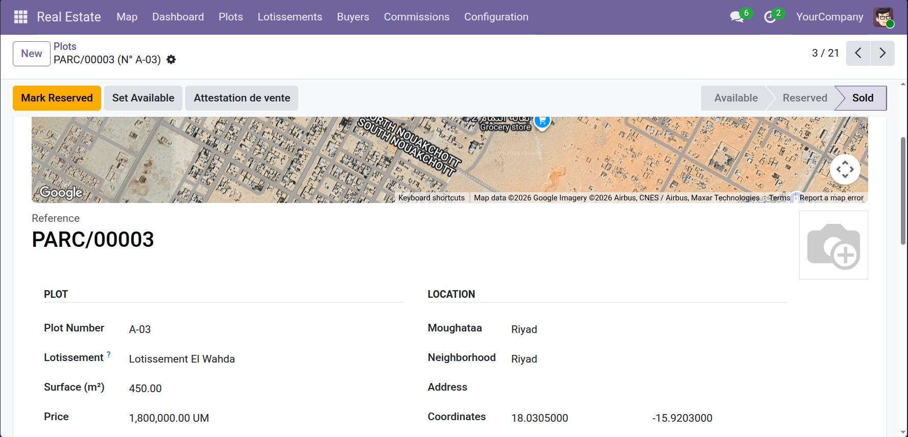

<p align="center">
  
</p>

<h1 align="center">Real Estate Agency — Mauritania</h1>

<p align="center">
  Manage the inventory and sale of land plots (parcelles) for a real estate
  agency in Nouakchott — with an interactive satellite map, sales and
  commissions, documents, reports and a manager dashboard.
</p>

<p align="center">
  
  
  
  
  
</p>

---

## Overview

**Real Estate Agency** is an Odoo 19 Community module tailored to agencies in
Mauritania that sell **plots of land**, often grouped into **subdivisions
(lotissements)**. It covers the full lifecycle — from listing a parcelle on a
satellite map, through reservation and sale, to agent commissions, paperwork
and management reporting.

All amounts are in **Mauritanian Ouguiya (MRU)**, and the interface ships in
**French** and **Arabic** as well as English.

---

## Screenshots

**Interactive map** — satellite basemap, colour-coded markers, filters and live count



**Manager dashboard** — KPIs, top agents and breakdown by moughataa



**Plot form** — location map on top, with details, photos and documents



---

## Features

### Interactive map
- Full-screen **Google Maps** client action with a **hybrid satellite + labels**
  basemap — see real buildings, streets and parcels.
- Colour-coded markers — available (green), reserved (orange), sold (red).
- Marker popups with a **photo carousel**, price, surface, lotissement,
  neighborhood, status and a **View Details** shortcut.
- **Sidebar filters** (status, lotissement, moughataa, price and surface ranges)
  applied instantly, with an *"X / Y shown"* counter.
- **Right-click** the map to quick-create a plot at that exact location.
- Opens focused on **Nouakchott West**, where most listings sit.

### Plot inventory
- Parcelles with auto-generated **reference** (`PARC/00001`), plot number,
  surface (m²), **price in MRU**, GPS coordinates, moughataa, neighborhood,
  tags, a **photo gallery**, **documents** and a rich-text **description**.
- Lifecycle **status workflow** (available → reserved → sold) with a statusbar.
- An on-form **mini-map** centred on the plot; drag the marker to set its
  coordinates.

### Lotissements
- Subdivisions with planned capacity and **live counts** of available,
  reserved and sold plots.

### Sales and commissions
- Record the **buyer**, **sale date**, **agreed price** and **agent** directly
  on the plot (shown once reserved or sold).
- Selling requires a buyer and a price; reserving stamps **who** reserved it and
  **when**.
- **Commissions** per sale — percentage or fixed — with a company-wide default
  rate, plus a **per-agent commission report**.

### Buyers
- `res.partner` extended to flag buyers, with a **Plots Bought** smart button and
  a dedicated **Buyers** menu.

### Documents and reports (QWeb PDF)
- **Attestation de vente** generated from a sold plot.
- **Commission report** for a chosen period and agent.
- **Inventory report** by status, moughataa and lotissement.
- Typed **document attachments** on each plot (titre foncier, plan, contract).

### Analytics
- **Manager dashboard** (OWL): KPI cards, sales/revenue/commission this month,
  top agents and a breakdown by moughataa.
- **Graph** and **pivot** views on plots.

### Localization and security
- French and Arabic translations out of the box.
- **User** and **Manager** roles; administrators get access automatically.

---

## Installation

> Requires **Odoo 19.0 Community** and a PostgreSQL database.

1. Place the module on your Odoo addons path:
   ```bash
   git clone git@github.com:emin-ahmed/real_estate_agency.git
   # ensure its parent folder is in your --addons-path
   ```
2. Update the apps list and install **Real Estate Agency (Mauritania)**, or:
   ```bash
   odoo-bin -d <db> -i real_estate_agency
   ```
3. To load the sample data (demo plots across Nouakchott), add `--with-demo` on
   a fresh database.

---

## Configuration

### Google Maps API key (required for the map)
The map uses the Google Maps JavaScript API. Create a key in the
[Google Cloud Console](https://console.cloud.google.com/) (enable **Maps
JavaScript API** and billing, and restrict it by HTTP referrer), then set it in:

> **Settings → Real Estate → Map → Google Maps API Key**

Until a key is set, the map area shows a hint instead of a map. The key is stored
as a system parameter — never hard-coded or committed.

### Default commission
> **Settings → Real Estate → Commissions** — set the default type (percentage or
> fixed) and rate pre-filled on new plots.

### Currency
The module operates in **MRU**, which it activates on install. Monetary figures
across plots, reports and the dashboard are shown in MRU.

---

## Tech stack

| Layer | Technology |
|------|------------|
| Backend | Odoo 19 ORM, Python |
| Frontend | OWL 2 components, SCSS |
| Map | Google Maps JavaScript API (hybrid basemap) |
| Reports | QWeb PDF |
| DB | PostgreSQL |

---

## Project structure

```
real_estate_agency/
├── models/          # plots, lotissements, moughataa, tags, photos, documents,
│                    #   partner & company/settings extensions
├── wizard/          # commission & inventory report wizards
├── report/          # QWeb report actions + templates
├── views/           # list/form/kanban/search/graph/pivot, menus, settings
├── static/src/      # OWL: map client action, on-form map widget, dashboard
├── data/            # moughataa, tags, sequence, MRU activation
├── demo/            # Mauritania-flavoured demo data
├── i18n/            # fr.po, ar.po
└── security/        # groups + access rights
```

---

## Roadmap

- **Cadastral parcel layer** — draw or import parcel boundary polygons and show a
  clickable lotissement outline with per-parcel details (surface, sides,
  elevation).

---

## Author

**Emin Ahmed** — [github.com/emin-ahmed](https://github.com/emin-ahmed)

## License

Released under the **LGPL-3** license.
